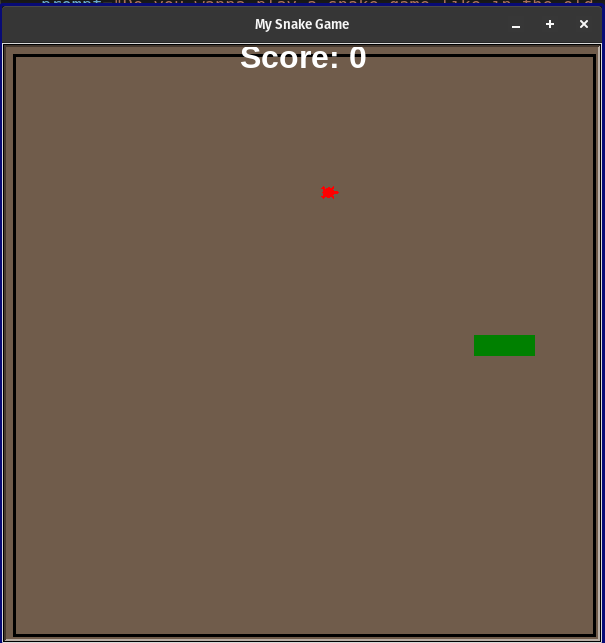
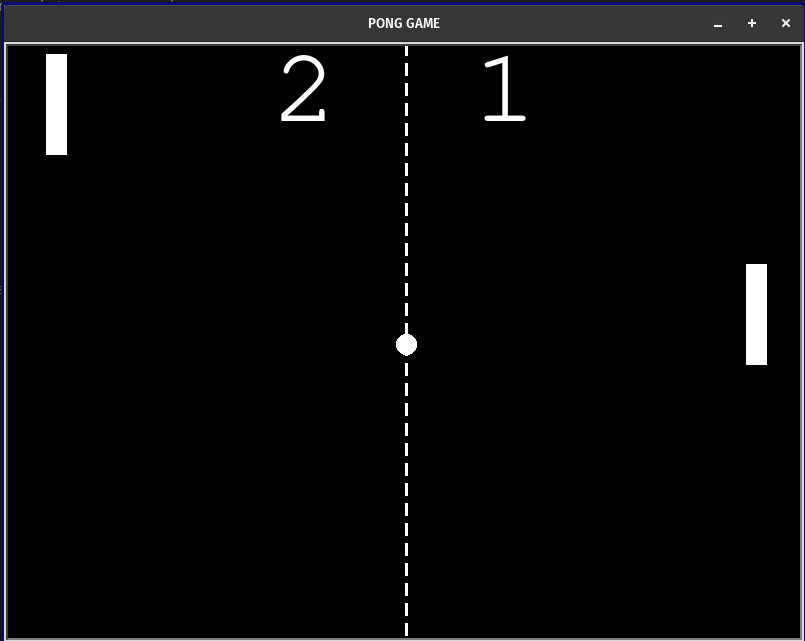
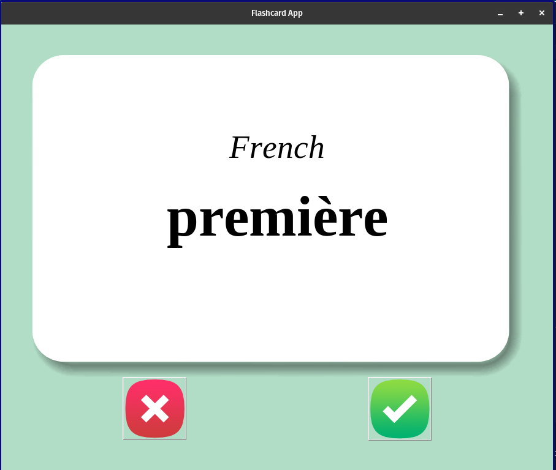
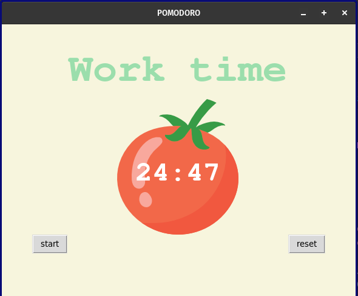
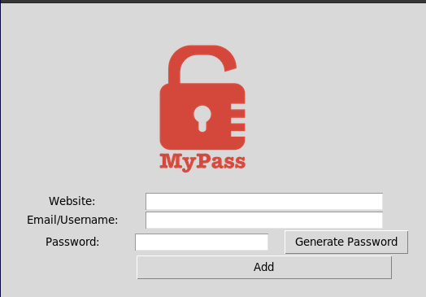
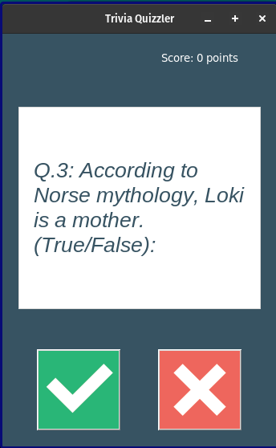

# Python Mini Projects Collection

A collection of beginner-to-intermediate Python projects built using Python libraries like Tkinter, Turtle Graphics, Requests, JSON handling, and APIs.

These projects helped me practice:
- GUI development
- Object-oriented programming
- API integration
- File handling
- Game logic
- Working with JSON and CSV data

---

# Projects Included

## 1. Snake Game

Classic Nokia-style Snake Game built using Turtle Graphics.

### Features
- Snake movement controls
- Food spawning
- Score tracking
- Collision detection
- Game over conditions
- Increasing difficulty

### Technologies Used
- Python
- Turtle Graphics

### Preview


---

## 2. Pong Game

A two-player Pong clone inspired by the retro arcade game.

### Features
- Two-player controls
- Ball physics and bouncing
- Scoreboard tracking
- Paddle collision detection
- Increasing ball speed over time

### Controls
| Player | Keys |
|---|---|
| Left Paddle | W / S |
| Right Paddle | ↑ / ↓ |

### Technologies Used
- Python
- Turtle Graphics

### Preview


---

## 3. Language Flashcards

A flashcard app for learning languages like French and Dutch.

### Features
- Language selection using radio buttons
- Flashcard flipping animation
- Tracks learned words
- Saves progress automatically using CSV files
- Dynamic language support

### Technologies Used
- Python
- Tkinter
- Pandas

### Preview


---

## 4. Pomodoro Timer

A Pomodoro productivity timer built with Tkinter.

### Features
- Work and break sessions
- Long break after multiple sessions
- Countdown timer
- Session checkmarks
- Reset functionality

### Technologies Used
- Python
- Tkinter

### Preview


---

## 5. Password Manager

A secure password manager with password generation and JSON storage.

### Features
- Random secure password generation
- Clipboard copy support
- Save credentials locally
- Search saved credentials
- JSON-based storage

### Technologies Used
- Python
- Tkinter
- JSON
- Pyperclip

### Preview


---

## 6. Quizzler App

A True/False quiz application using trivia questions fetched from an API.

### Features
- API-based quiz questions
- Score tracking
- Real-time feedback
- Multiple quiz rounds

### API Used
- https://opentdb.com/api.php

### Technologies Used
- Python
- Tkinter
- Requests API

### Preview


---

## 7. Kanye Says

A fun quote generator app using the Kanye REST API.

### Features
- Fetches random Kanye West quotes
- API integration
- Interactive GUI
- Dynamic quote updates

### API Used
- https://api.kanye.rest

### Technologies Used
- Python
- Tkinter
- Requests API

### Preview


---
# Running the Projects

Clone the repository:

```bash
git clone https://github.com/your-username/your-repository-name.git
```

Run any project using Python:

```bash
python main.py
```

Example:

```bash
cd snake_game
python main.py
```

---

# What I Learned

Through these projects I practiced:
- Event-driven programming
- GUI development with Tkinter
- Python OOP concepts
- API requests and JSON parsing
- File handling and persistence
- Game loops and collision detection

---

# Author

Built with Python and questionable sleep schedules.